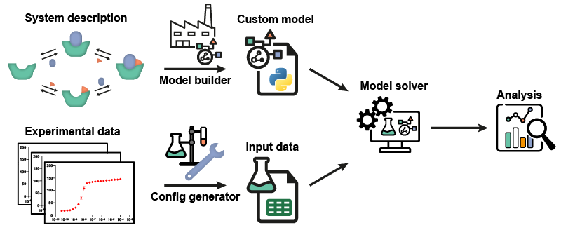

The framework for models of thermodynamic equilibrium systems
=============================================================

.. image:: https://zenodo.org/badge/DOI/10.5281/zenodo.5531622.svg
   :target: https://doi.org/10.5281/zenodo.5531622
   
Model-framework is a framework for chemical equilibrium models that utilizes a
general derivation method capable of generating custom models for complex
molecular systems, based on the simple, reversible reactions describing
these systems. Some case studies illustrating the framework are described in the `prepublished paper <https://doi.org/10.1101/2021.11.18.469126>`_ with details on the procedure
in the accompanying Supplementary Material. The *framework* is  also available from `Github <https://github.com/TUe-chemical-biology/model-framework>`_.

This documentation serves as overview and reference to the available analysis functions included in the base distribution of the *framework*.

Contents
--------
	   
.. toctree::
   :maxdepth: 2  
   
   analysis
